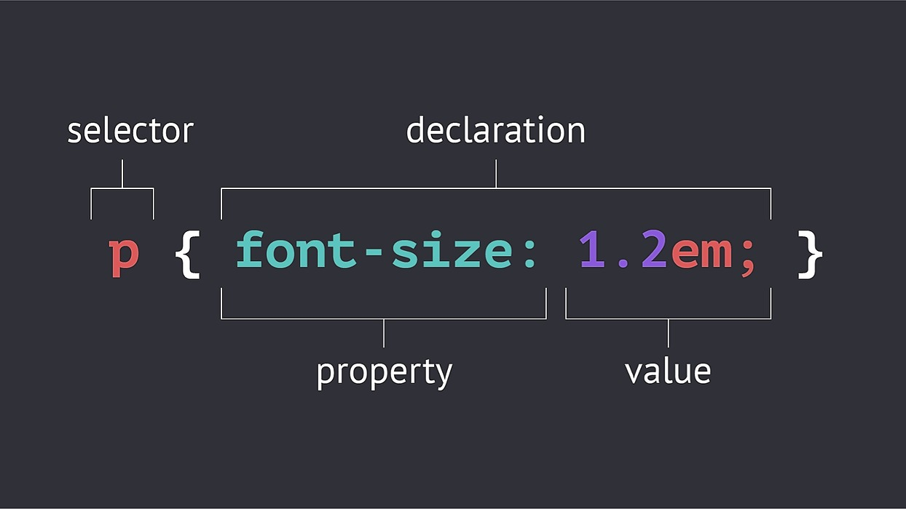
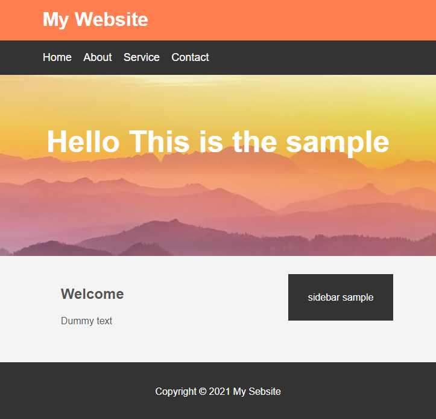

## CSS
### Three ways to insert CSS
- Inline CSS (Not recommended)
- Internal CSS (Use style tag)
- External CSS (Use external .css file)

### CSS Selector


### Colors in CSS
- Color Names
- HTML5 color names
- Hexadecimal
- RGB

### Class in CSS
When class of element is declared, .css file is able to refer it by using `dot classname`

### margin & padding
- `margin: auto` in container makes equivalent space in browser.
- padding surround content and margin surround outter thing
- Possible to use clockwise notation to shorthand

### Box Model


### Apply everything in CSS
```CSS
/* Top of the file */
*{
  /* Here */
}
```

### Select Tag in Class
```CSS
.box-1 h1{
    /* Any h1 in this within this class */
}
```

### Positioning in CSS
- Static
- Relative
- Absolute
- Fixed
- Initial
- Inherit

### Result
